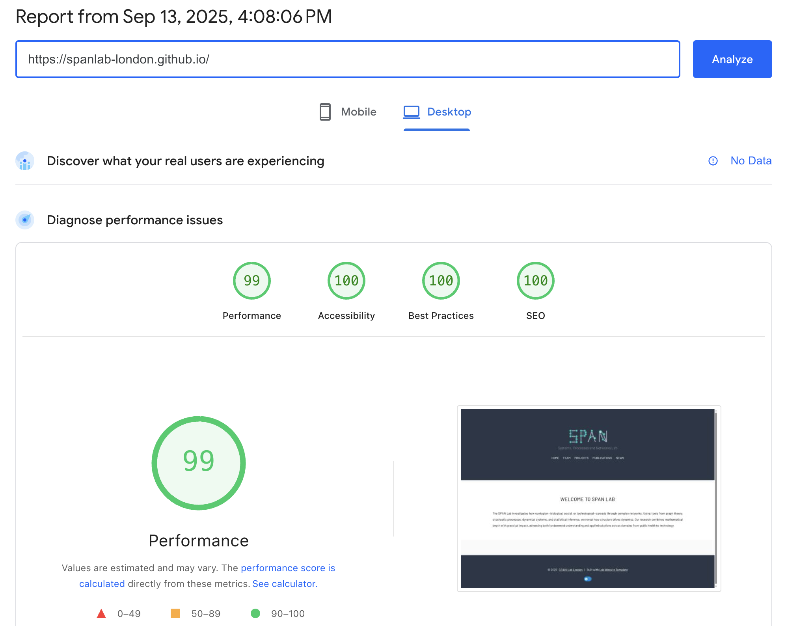

# spanlab-london.github.io
This repository contains the source code for the website of the **Systems, Processes and Networks (SPAN) Lab, London**.

- The site is live at [spanlab-london.github.io](https://spanlab-london.github.io/)

- Built using the [Lab Website Template by Greene Lab](https://github.com/greenelab/lab-website-template)

### Added features:
- Local build and deployment process using a custom `deploy.sh` script
- New wide row-based layout for the Projects page
- Refined the Team page with roles for the Lead, PhD Students, and Alumni
- Replaced "Blog" section with "News" section
- Explicit "Home" button to the main nav bar for clarity
- Modified "Search for papers" link on member pages
- Custom favicons
- Custom square SVG logo for the SPAN Lab GitHub organization profile (could be animated)


## Build and deploy workflow
This website uses a **local build** process. 

The source code, which includes Markdown files, layouts, and data, is stored in the `main` branch. The live website is served from the static HTML files located in the `gh-pages` branch.

Updating the website is a two-step process:
1. Pushing source code changes to the `main` branch
2. Running `deploy.sh` script to build and deploy the site

To make changes and publish them to the live site:

### Step 1: make and push your changes to `main`
Make any desired edits to the source files: 
- updating a member bio in `/_members`
- adding a news post in `/_posts`, 
- adding a publication,
- etc.

#### Adding pictures for publications
You can add pictures for publications, by:
* first add the image (in png, jpg, or svg, keep it small) to [images](https://github.com/spanlab-london/spanlab-london.github.io/tree/22d8ff0d5ac091e5a55e8e224868cd427ee580b8/images) 

* and then add the path to the yaml file in: [_data/citations.yaml](https://github.com/spanlab-london/spanlab-london.github.io/blob/22d8ff0d5ac091e5a55e8e224868cd427ee580b8/_data/citations.yaml)

##### Example 
You can see an example for the first item:
* image: [images/Revised_Cover_2_compressed.png](https://github.com/spanlab-london/spanlab-london.github.io/blob/22d8ff0d5ac091e5a55e8e224868cd427ee580b8/images/Revised_Cover_2_compressed.png)
* item in the yaml file in:
```yaml
# NOTE: added 'Mathematics of epidemics on networks' book for the highlighted publication
- id: doi:10.1007/978-3-319-50806-1
  # path:
  image: images/Revised_Cover_2_compressed.png```
```

Then, commit your changes and push them to the `main` branch.

```bash
git add .
git commit -m "describe your changes to the source code"
git push origin main
```

**Note:** This step only updates the source code but not the website.

### Step 2: Run the deployment script
To build the site and publish your changes, run the `deploy.sh` script:

```bash
./deploy.sh
```

The `deploy.sh` script:
- Runs `bundle exec jekyll build` which compiles the source code from `main` into a static website in the `_site` directory

- Initializes a temporary git repository, commits all the static files, and adds the remote repository url

- Force-pushes the contents of the `_site` directory to the `gh-pages` branch, overwriting any previous content


The live site [spanlab-london.github.io](https://spanlab-london.github.io/) is then updated by GitHub Pages with the new content of the `gh-pages` branch automatically, which can take a minute or two.


## Website performance



PageSpeed Insights: [report](https://pagespeed.web.dev/analysis/https-spanlab-london-github-io/z7x58tfb5k?form_factor=desktop)


